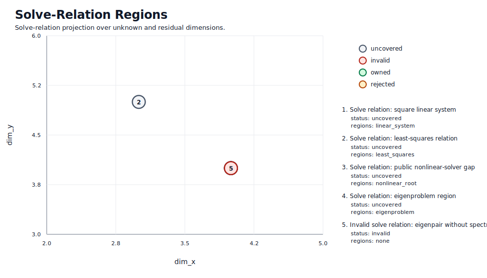
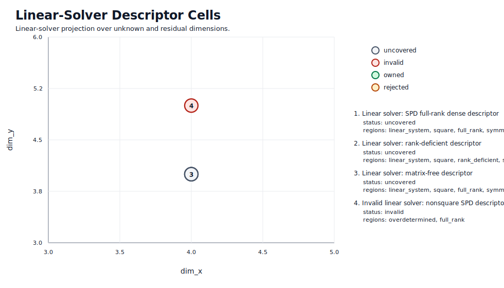
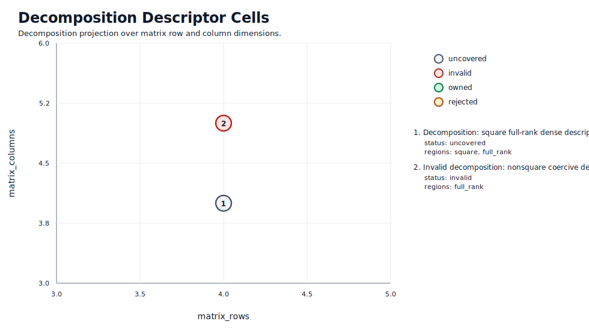

# Capability Coverage Atlas

<!-- Generated from tests/test_structure.py; do not edit by hand. -->

This page is a projection of the parameter-space schemas used by the
structural test registry.  Each plot names the axes shown directly, the
coordinates fixed outside the projection, and the higher-dimensional axes
that are only summarized.  Ownership is intentionally sparse at this
stage: solver and decomposition implementations have not yet been
converted from string-set capability tags to coverage patches.

Status legend:

- `invalid`: the descriptor violates a schema validity rule.
- `owned`: at least one coverage patch owns the descriptor.
- `rejected`: coverage patches intentionally reject the descriptor.
- `uncovered`: the descriptor is valid but no coverage patch owns it.

## Projection Plots

### Solve-Relation Regions

Shown axes: `dim_x` and `dim_y`.
Fixed axes: `acceptance_relation`, `derivative_oracle_kind`, `dim_x`, `dim_y`, `objective_relation`, `residual_target_available`, `target_is_zero`.
Marginalized axes: `backend_kind`, `device_kind`, `memory_budget_bytes`, `work_budget_fmas`.

### Linear-Solver Descriptor Cells

Shown axes: `dim_x` and `dim_y`.
Fixed axes: `dim_x`, `dim_y`, `linear_operator_matrix_available`, `map_linearity_defect`, `objective_relation`, `operator_application_available`, `singular_value_lower_bound`.
Marginalized axes: `backend_kind`, `device_kind`, `memory_budget_bytes`, `work_budget_fmas`.

### Decomposition Descriptor Cells

Shown axes: `matrix_rows` and `matrix_columns`.
Fixed axes: `factorization_memory_budget_bytes`, `factorization_work_budget_fmas`.
Marginalized axes: `assembly_cost_fmas`, `linear_operator_memory_bytes`.

## Coverage Patches

No solver or decomposition ownership patches are declared in this
atlas yet.  The next sprint items convert existing linear-solver and
decomposition capabilities into bounded coverage patches with explicit
cost models and priority rules.

## Known Gaps

### nonlinear algebraic solve F(x) = 0

- Region: `nonlinear_root`
- Selected owner: none
- Descriptor:
  - `map_linearity_defect > eps or unavailable`
  - `residual_target_available = false or target_is_zero = true`
  - `derivative_oracle_kind in {none, matrix, jvp, vjp, jacobian_callback}`
  - `acceptance_relation = residual_below_tolerance`
  - `requested_residual_tolerance = finite`
- Existing partial owners:
  - time_integrators._newton.nonlinear_solve is internal stage machinery, not a public nonlinear-system solver capability.
- Required capability before this region is owned: NonlinearSolver with descriptor bounds for residual norm, Jacobian availability, local convergence radius or globalization policy, line-search or trust-region safeguards, max residual evaluations, and failure reporting.

## Numerical Evidence Overlay

No owned solver or decomposition coverage patch has numerical evidence
metadata in this atlas yet.  Until ownership patches exist, numerical
correctness, convergence, performance, and regression claims remain
outside this projection rather than being attached to cells.
